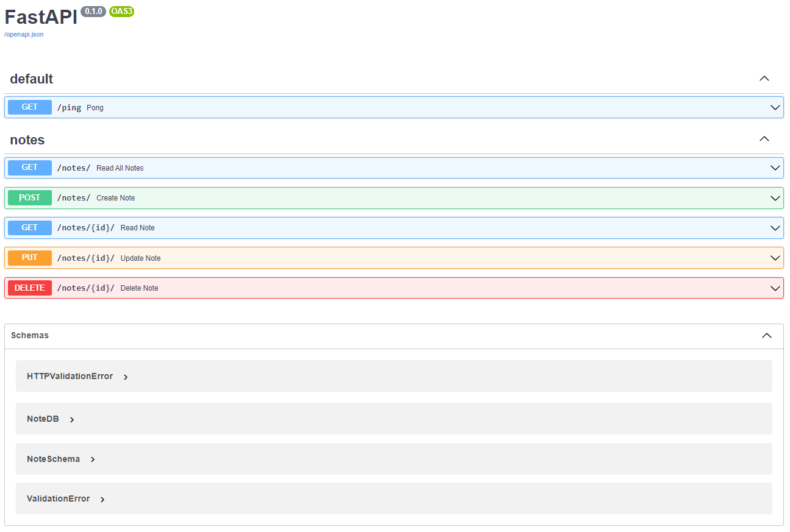

# Fastapi CRUD API
## Description
A RESTful API built with FastAPI and PostgreSQL. Implements CRUD operations and follows TDD principles using pytest. Includes Dockerfile and Docker Compose for easy deployment.

## Project Structure
```
fastapi-crud
    ├── docker-compose.yml
    └── src
        ├── Dockerfile
        ├── app
        │   ├── __init__.py
        │   ├── api
        │   │   ├── __init__.py
        │   │   ├── crud.py
        │   │   ├── models.py
        │   │   ├── notes.py
        │   │   └── ping.py
        │   ├── db.py
        │   └── main.py
        ├── requirements.txt
        └── tests
            ├── __init__.py
            ├── conftest.py
            ├── test_notes.py
            └── test_ping.py
```

## Features
- CRUD operations
- TDD with pytest
- Docker support

## Getting Started
###  Prerequisites
- Docker
- Docker Compose 

### Setup
1. Clone the repository
```
git clone git@github.com:rentbest/fastapi_testing.git
сd fastapi_testing
```
2. Build and run Dockker containers
```
docker-compose up --build
```
3. Access the API at http://localhost:8002.
4. It's also convenient to test the API using the built-in Swagger interface in FastAPI, available at http://localhost:8002/docs.


### Running Tests
To run the tests, use:
```
docker-compose exec web pytest
```

## Endpoints:

| Method  | route        | Description    |
|---------|--------------|----------------|
| <span style="color:#1E90FF">GET</span>     | /ping        | Pong           |
| <span style="color:#1E90FF">GET</span>     | /notes/      | Read All Notes |
| <span style="color:#32CD32">POST</span>    | /notes/      | Create Note    |
| <span style="color:#1E90FF">GET</span>     | /notes/{id}/ | Read Note      |
| <span style="color:#FFA500">PUT</span>    | /notes/{id}/ | Update Note    |
| <span style="color:#FF4500">DELETE</span> | /notes/{id}/ | Delete Note    |
